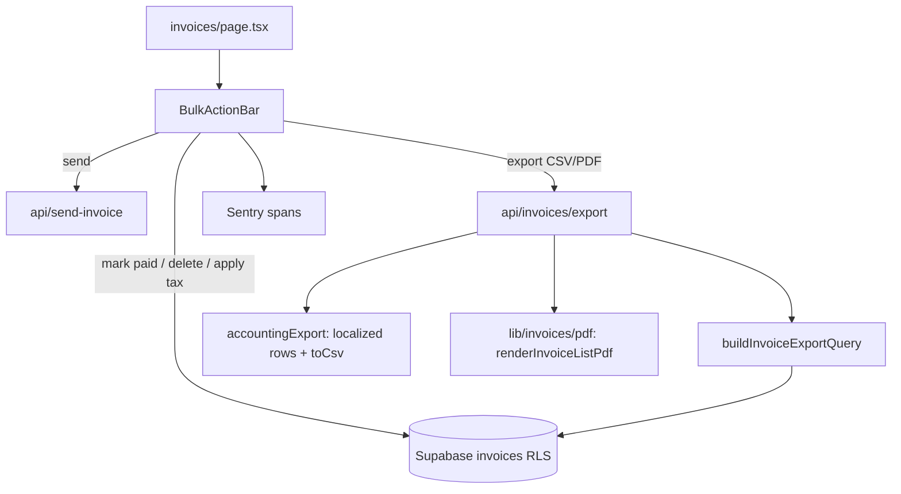

# Requirements

### Overview & Goals
Continue the **enterprise invoicing upgrade** (`.junie/plans/enterprise-invoicing-upgrade.md`). Step 1 (server-side list query, filters, sorting, search, pagination) is already built and wired into `app/dashboard/invoices/page.tsx`. This phase delivers **Step 2 — List page: bulk actions & filtered CSV/PDF export**, and also finishes a gap left by Step 1: the list page references an `invoices.list.*` i18n namespace that is **missing from all 8 locales**, and the planned `invoices-i18n-parity.test.js` was never added.

The work stays behind the existing `invoiceListV2` feature flag and reuses the established stack (Supabase + RLS, `next-intl`, `@react-pdf/renderer`, Sentry).

### Scope
**In Scope**
- **Finish Step 1 localization:** add every `invoices.list.*` key the list page already calls (search, filters, status, results, row, errors) across `en, es, fr, de, it, pt, tr, ar` (RTL-correct), plus an `invoices` namespace i18n parity test.
- **Bulk actions** on selected invoices: **mark paid**, **send** (reuse `POST /api/send-invoice`), **delete** (with confirmation), and **apply tax rate**, all with an accessible selection model and per-item success/failure reporting.
- **Filtered export**: export exactly what the active filters show as **CSV** (locale-aware) or **PDF** (deterministic, multi-invoice), served by a new authenticated `POST /api/invoices/export` route that reuses the Step 1 query so filters are honored.
- Sentry instrumentation for bulk + export flows; full WCAG 2.1 AA for new controls.

**Out of Scope**
- Detail/Create-Edit/Generation slices (Steps 3–6).
- Any DB migration (this phase needs none — see Technical Design).
- A `discount` column / bulk discount persistence (the schema has no discount column; only **tax rate** is applied in bulk this phase).
- The legacy per-card `html2canvas`/`jspdf` single-invoice export (left as-is).

### User Stories
- As a finance user, I want to select many invoices and mark them paid, send, delete, or apply a tax rate in one action, so I can manage large volumes efficiently.
- As a finance user, I want each bulk action to report which invoices succeeded or failed, so I can retry only the failures.
- As a user, I want to export the currently filtered invoice list to CSV or PDF, so my export matches exactly what I'm looking at.
- As an international user, I want exports and all new controls localized and RTL-correct in my language.

### Functional Requirements
- Selection persists across the current page; a clear summary shows the selected count with an ARIA live region.
- **Mark paid** sets `status = 'paid'`; **delete** removes rows after a confirm step; **send** calls the existing `/api/send-invoice`; **apply tax rate** sets `tax_rate_percentage` and recomputes `tax_amount = subtotal * rate/100` and `total = subtotal + tax_amount` (rounded to 2 decimals, matching the create page).
- All bulk mutations run under existing RLS via the browser Supabase client; per-item results are reported and the list refetches on completion.
- **Export** posts the active `InvoiceQueryParams` + chosen `format` (`csv`|`pdf`) + `locale`; the server applies the same filters/sort and returns a downloadable file with embedded metadata (generated-at, filter summary, locale).
- CSV uses locale-aware number/date formatting and localized headers; PDF lists all filtered invoices in a deterministic table.

### Non-Functional Requirements
- Exports cap at a safe maximum row count and surface a clear message when exceeded.
- All new UI strings localized in 8 locales (RTL-correct for `ar`); the parity test enforces key-set + ICU placeholder parity continuously.
- Bulk + export flows wrapped in Sentry spans; failures reported via `Sentry.captureException`. No secrets on the client.
- New surface stays behind `invoiceListV2` for safe Vercel rollout/rollback.

# Technical Design

### Current Implementation
- **List page** `app/dashboard/invoices/page.tsx` (Step 1, `'use client'`) drives state from the URL via `useSearchParams`/`router.replace`, fetches a server-paged slice with `hooks/useInvoicesQuery.ts` → `lib/invoices/query.ts#buildInvoiceQuery`, and already has an **inline** selection model + bulk-send loop calling `/api/send-invoice`, plus per-card client-side PDF export.
- **Query lib** `lib/invoices/query.ts` exposes `InvoiceQueryParams`, `buildInvoiceQuery` (applies `.eq/.in/.gte/.lte/.contains/.ilike/.order/.range` + a `head:true` count), `parseInvoiceParams`/`serializeInvoiceParams`, `INVOICE_LIST_COLUMNS`, and a private `applyFilters` helper. `buildInvoiceQuery` is paginated (`.range`).
- **CSV engine** `lib/accountingExport.ts` provides `toCsv` (BOM + CRLF), `toExcelHtml`, and `buildInvoiceExportRows` (English headers, `toFixed(2)` numbers).
- **Export route pattern** `app/api/accounting/export/route.ts` authenticates via `Authorization: Bearer <token>` → `createClient(accessToken)` (`@/lib/supabase/server`) → `supabase.auth.getUser(accessToken)` → query under RLS → returns a `Response` with `Content-Disposition: attachment`.
- **Invoice money columns** (from the create insert): `subtotal`, `tax_rate_percentage`, `tax_amount`, `total`, `status`, `items` (jsonb), `notes`, `currency`. There is **no discount column**. An `updated_at` trigger (Step 1 migration) auto-stamps on every write.
- **i18n gap:** the page calls `useTranslations('invoices.list')` (keys: `search.*`, `filters.status`, `status.*`, `results.*`, `row.*`, `errors.*`), but `invoices.list` is absent from every `messages/*.json`; `__tests__/invoices-i18n-parity.test.js` does not exist.
- Installed + ready: `@react-pdf/renderer ^4.5.1` (Node `renderToBuffer(doc): Promise<Buffer>`), `@sentry/nextjs`, `formatCurrencyAmount` (`Intl.NumberFormat`) in `lib/currency.js`.

> Per the `nextjs-agent-rules` guideline: before wiring the new route handler, consult `node_modules/next/dist/docs/` for Next.js 16 route-handler/runtime/`Response` conventions, which may differ from training data.

### Key Decisions (confirmed with user)
- **Scope = Step 2 + finish Step 1 i18n.** The new parity test depends on the `invoices.list` keys existing in all locales, so completing them is a prerequisite, not optional.
- **Server-side export reusing the Step 1 query.** A new `POST /api/invoices/export` mirrors the accounting route's bearer-auth and reuses the Step 1 filter logic so the export honors the exact active filters; CSV via extended `accountingExport`, PDF via `@react-pdf/renderer` (`runtime = 'nodejs'`). Chosen over client-side export for determinism and full-result (not just current page) coverage.
- **Bulk “apply tax rate” only (no migration).** Bulk-set `tax_rate_percentage` and recompute `tax_amount`/`total` from each row's `subtotal`; persisted via RLS update. No discount column exists, so no bulk discount this phase and **no DB migration** is required.
- **Bulk mutations via the browser client under RLS** (parity with the existing page), except **send** which reuses the existing `/api/send-invoice` endpoint.
- **Unpaged export query.** Because `buildInvoiceQuery` applies `.range()`, add a sibling `buildInvoiceExportQuery` in the same module that reuses `applyFilters` without `.range()`, capped at `MAX_EXPORT_ROWS`, selecting a richer `INVOICE_EXPORT_COLUMNS` set.

### Proposed Changes
- **`lib/invoices/query.ts`** — add `INVOICE_EXPORT_COLUMNS`, `MAX_EXPORT_ROWS`, and `buildInvoiceExportQuery(supabase, userId, params)` (reuses `applyFilters` + `.order`, omits `.range`, `.limit(MAX_EXPORT_ROWS)`).
- **`lib/accountingExport.ts`** — add `buildLocalizedInvoiceExportRows(invoices, { locale, labels, filterSummary })`: localized headers, locale-aware numbers (`formatCurrencyAmount`) + dates (`Intl.DateTimeFormat`), and prepended metadata rows; reuse `toCsv`.
- **`lib/invoices/pdf.tsx`** (new) — `InvoiceListPdf` (`Document`/`Page`/`View`/`Text`/`StyleSheet`) rendering a metadata header + invoice table, and `renderInvoiceListPdf(props): Promise<Buffer>` via `renderToBuffer`.
- **`app/api/invoices/export/route.ts`** (new) — `runtime = 'nodejs'`, `dynamic = 'force-dynamic'`; bearer-auth; parse params + `format` + `locale`; `buildInvoiceExportQuery`; build CSV or PDF; return as `attachment`.
- **`components/invoices/BulkActionBar.tsx`** (new) — accessible bulk toolbar: mark paid / send / delete (confirm) / apply tax rate / export CSV / export PDF, with per-item result reporting, ARIA live region, disabled/loading states, Sentry spans.
- **`app/dashboard/invoices/page.tsx`** — replace the inline selection/bulk-send block with `BulkActionBar`; keep selection state + `refetch()`; pass active `params` so export targets the filtered set.
- **`messages/*.json` (8 locales)** — add the missing `invoices.list.*` keys and the new bulk/export keys (e.g. `invoices.list.bulk.*`, `invoices.list.export.*`).
- **`__tests__/invoices-i18n-parity.test.js`** (new) — parity for the whole `invoices` namespace.

### Data Models / Contracts
```ts
// lib/invoices/query.ts (additions)
export const INVOICE_EXPORT_COLUMNS =
  'id, invoice_number, client_name, project_name, status, currency, subtotal, tax_amount, total, due_date, created_at, notes, tags'
export const MAX_EXPORT_ROWS = 5000
export function buildInvoiceExportQuery(
  supabase: SupabaseClient, userId: string, p: InvoiceQueryParams,
): { rows: any } // applyFilters + .order, NO .range, .limit(MAX_EXPORT_ROWS)
```
```ts
// lib/accountingExport.ts (addition)
export interface LocalizedExportOptions {
  locale: string
  labels: Record<'invoiceNumber'|'client'|'project'|'status'|'subtotal'|'tax'|'total'|'currency'|'dueDate'|'createdAt', string>
  meta: { generatedAt: string; filterSummary: string; locale: string }
}
export function buildLocalizedInvoiceExportRows(
  invoices: AccountingInvoice[], opts: LocalizedExportOptions,
): unknown[][]
```
```tsx
// lib/invoices/pdf.tsx
export interface InvoiceListPdfProps {
  invoices: ExportInvoice[]; locale: string
  meta: { generatedAt: string; filterSummary: string }; labels: Record<string,string>
}
export function InvoiceListPdf(p: InvoiceListPdfProps): JSX.Element
export function renderInvoiceListPdf(p: InvoiceListPdfProps): Promise<Buffer> // renderToBuffer
```
```ts
// app/api/invoices/export/route.ts
export const runtime = 'nodejs'
export const dynamic = 'force-dynamic'
// POST body: { params: Record<string,string>; format: 'csv'|'pdf'; locale: string }
// -> 401 if no/invalid bearer; else CSV (text/csv) or PDF (application/pdf) attachment
```
```ts
// components/invoices/BulkActionBar.tsx
interface BulkActionBarProps {
  selectedIds: string[]; invoices: InvoiceListRow[]
  params: InvoiceQueryParams; onChangeSelection(ids: string[]): void; onDone(): void
}
```

### Components
- **New:** `components/invoices/BulkActionBar.tsx` (selection summary, action buttons, confirm-delete, per-item results, export menu).
- **Extended:** `app/dashboard/invoices/page.tsx` (delegates selection/bulk to `BulkActionBar`), `lib/invoices/query.ts`, `lib/accountingExport.ts`.
- **Reused:** `/api/send-invoice`, `Card`/`Button`/`Badge`, `useDebounce`, `formatCurrencyAmount`, Sentry.

### File Structure
- New: `components/invoices/BulkActionBar.tsx`, `lib/invoices/pdf.tsx`, `app/api/invoices/export/route.ts`, `__tests__/invoices-i18n-parity.test.js`, `__tests__/invoices-export-route.test.*`, `__tests__/invoices-bulk-actions.test.*`.
- Modified: `lib/invoices/query.ts`, `lib/accountingExport.ts`, `app/dashboard/invoices/page.tsx`, `messages/{en,es,fr,de,it,pt,tr,ar}.json`, and the existing `__tests__/invoices-page-bulk-send.test.js` (retargeted to `BulkActionBar`).
- **No** new `supabase/migrations/*` file.

### Architecture Diagram


### Risks
- **`@react-pdf/renderer` runtime:** must run on Node, not Edge — set `runtime = 'nodejs'` and verify per Next.js 16 docs.
- **Large exports:** cap at `MAX_EXPORT_ROWS`; show a clear localized message when exceeded.
- **Destructive bulk delete:** require confirmation and report per-item results; rely on RLS so cross-user rows are untouchable.
- **Tax recompute correctness:** compute from persisted `subtotal` (not re-derived from items) and round to 2 decimals to match the create page.
- **i18n parity forcing function:** every stage must add new keys to all 8 locales or the parity test fails (intended).
- **Existing bulk-send test** will break when the inline block moves into `BulkActionBar`; it is updated in the same stage.

# Testing

### Validation Approach
Validate with Jest + Testing Library (existing `jest.config.js`) for components/hooks/routes and pure-logic unit tests for libs, plus `npm run lint` and `npm run build` to catch type/route regressions. i18n is validated by a parity test asserting key-set, non-empty values, and ICU placeholder parity across all 8 locales.

### Key Scenarios
- **i18n parity:** `__tests__/invoices-i18n-parity.test.js` (mirroring `subscription-i18n-parity.test.js`) confirms the `invoices` namespace has identical keys and ICU placeholders across `en, es, fr, de, it, pt, tr, ar` with no empty values.
- **Bulk actions:** selecting invoices and dispatching mark-paid / send / delete / apply-tax updates the right rows and reports per-item success/failure; the list refetches on completion.
- **Tax recompute math:** `tax_amount = round(subtotal * rate/100, 2)` and `total = round(subtotal + tax_amount, 2)` for representative rates (0, 7.5, 20).
- **Export query:** `buildInvoiceExportQuery` applies all filters, omits `.range`, and caps at `MAX_EXPORT_ROWS`.
- **Localized CSV:** `buildLocalizedInvoiceExportRows` produces locale-correct numbers/dates and a metadata header for `de` and `ar`; output is deterministic.
- **Export route:** `POST /api/invoices/export` returns **401** without a bearer token, a `text/csv` attachment for `format=csv`, and an `application/pdf` attachment for `format=pdf`, honoring filters.

### Edge Cases
- Empty selection disables bulk action buttons; empty filter result yields an export with headers + metadata only (or a clear “nothing to export” message).
- A partial failure in a bulk run still reports the successful items and surfaces the failed ones.
- RTL (`ar`) layout for the `BulkActionBar` controls and CSV header direction.
- Export exceeding `MAX_EXPORT_ROWS` returns a clear, localized message instead of a truncated-without-notice file.
- Cross-user invoice IDs cannot be mutated/exported (enforced by RLS) — covered by a negative-access test.

### Test Changes
- **Add:** `__tests__/invoices-i18n-parity.test.js`, `__tests__/invoices-bulk-actions.test.*` (Testing Library: selection, dispatch, per-item results, tax math), `__tests__/invoices-export-route.test.*` (auth, content-types, filter honoring), and unit tests for `buildInvoiceExportQuery` + `buildLocalizedInvoiceExportRows`.
- **Update:** `__tests__/invoices-page-bulk-send.test.js` to target the new `BulkActionBar` instead of the inline block.
- **Reuse:** existing `__tests__/invoices-query.test.js` remains valid (Step 1).

# Delivery Steps

### ✓ Step 1: Finish Step 1 localization + add invoices i18n parity test
The list page renders fully localized in all 8 locales and a parity test guards the `invoices` namespace.

- Add the missing `invoices.list.*` keys the page already calls to `messages/en.json`: `search.{label,placeholder}`, `filters.status`, `status.{draft,sent,viewed,paid,overdue,disputed,cancelled}`, `results.{total,empty,emptyHint,noMatches,noMatchesHint}`, `row.{selectOne,unknownClient,noProject,dueLabel}`, `errors.{retry,supabaseInit,loginRequired,query}`.
- Translate the identical key set into `es, fr, de, it, pt, tr, ar` (RTL-correct), matching existing tone and ICU placeholders.
- Add `__tests__/invoices-i18n-parity.test.js` mirroring `__tests__/subscription-i18n-parity.test.js` (key-set equality, no empty values, ICU placeholder parity) for the `invoices` namespace.
- Run `npm test` to confirm the parity test passes and the list page no longer references missing keys.

### ✓ Step 2: Build the accessible BulkActionBar (mark paid, send, delete, apply tax rate)
The list page has an accessible `BulkActionBar` performing mark-paid, send, delete, and apply-tax across selected invoices with per-item results.

- Add `components/invoices/BulkActionBar.tsx`: selection summary with an ARIA live region, action buttons, a confirm step for delete, a per-item success/failure list, and disabled/loading states.
- Implement mark paid (`update({ status: 'paid' })`), delete (RLS delete after confirm), and apply tax rate (set `tax_rate_percentage`, recompute `tax_amount = round(subtotal*rate/100,2)` and `total = round(subtotal+tax_amount,2)`) via the browser Supabase client under RLS; reuse `POST /api/send-invoice` for send.
- Refactor `app/dashboard/invoices/page.tsx` to delegate the existing inline selection/bulk-send block to `BulkActionBar`, keeping selection state and calling `refetch()` on completion.
- Wrap each bulk run in a Sentry span (mirroring `useInvoicesQuery`) and report failures via `Sentry.captureException`; localize all new `invoices.list.bulk.*` strings across all 8 locales (keeping parity green).
- Add `__tests__/invoices-bulk-actions.test.*` and update `__tests__/invoices-page-bulk-send.test.js` to target the new component (selection, dispatch, per-item results, tax math).

### ✓ Step 3: Add locale-aware CSV builder, server PDF module, and unpaged export query
Reusable, tested builders produce a deterministic locale-aware CSV and a multi-invoice PDF from a filtered set.

- Extend `lib/invoices/query.ts` with `INVOICE_EXPORT_COLUMNS`, `MAX_EXPORT_ROWS`, and `buildInvoiceExportQuery(supabase, userId, params)` that reuses the existing `applyFilters` logic, keeps ordering, omits `.range()`, and applies `.limit(MAX_EXPORT_ROWS)`.
- Extend `lib/accountingExport.ts` with `buildLocalizedInvoiceExportRows(invoices, { locale, labels, meta })` using `formatCurrencyAmount` + `Intl.DateTimeFormat` for locale-aware values, localized headers, and prepended metadata rows (generated-at, filter summary, locale); reuse `toCsv`.
- Add `lib/invoices/pdf.tsx` using `@react-pdf/renderer`: an `InvoiceListPdf` document (metadata header + invoice table) and `renderInvoiceListPdf(props): Promise<Buffer>` via `renderToBuffer`.
- Add unit tests: `buildInvoiceExportQuery` (filters applied, no range, capped), `buildLocalizedInvoiceExportRows` (`de` + `ar` number/date formatting and metadata header), and CSV determinism.

### ✓ Step 4: Add the export API route and wire CSV/PDF export into the toolbar
Users can export exactly the filtered list as CSV or PDF from the toolbar, served by an authenticated route.

- Before wiring, consult `node_modules/next/dist/docs/` for Next.js 16 route-handler/runtime/`Response` conventions (per the `nextjs-agent-rules` guideline).
- Add `app/api/invoices/export/route.ts` with `runtime = 'nodejs'` and `dynamic = 'force-dynamic'`: bearer-auth like `app/api/accounting/export/route.ts`, parse `InvoiceQueryParams` + `format` (`csv`|`pdf`) + `locale`, run `buildInvoiceExportQuery`, then build CSV (`buildLocalizedInvoiceExportRows` + `toCsv`) or PDF (`renderInvoiceListPdf`) and return it as an `attachment` with the correct content-type and filename.
- Add CSV/PDF export controls to `BulkActionBar`/toolbar in `app/dashboard/invoices/page.tsx` that POST the active `serializeInvoiceParams(params)` + chosen format + `locale`, download the returned blob, and show success/error toasts; wrap the call in a Sentry span.
- Localize new `invoices.list.export.*` strings across all 8 locales (parity maintained) and add `__tests__/invoices-export-route.test.*` (401 without bearer, CSV/PDF content-types + `Content-Disposition`, filters honored); finish with `npm run lint` and `npm run build`.