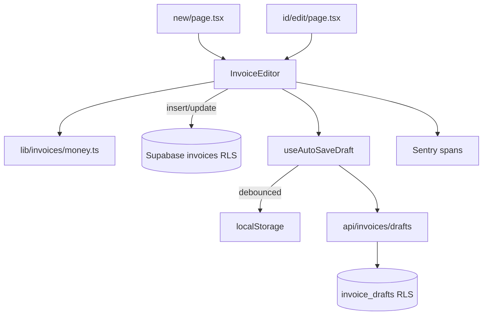

# Requirements

### Overview & Goals
Continue the **enterprise invoicing upgrade** (`.junie/plans/enterprise-invoicing-upgrade.md`). Steps 1–4 (list query/filters/sort/search/pagination, bulk actions + filtered CSV/PDF export, detail status-timeline/payments/history, detail comments/share-link/print) are complete and green. This phase delivers the **authoring core of Step 5 — Create/Edit** (confirmed scope with the user): a single localized, accessible editor shared by `new` + `[id]/edit`, a richer money engine (multi-rate + inclusive/exclusive tax, fixed/percent discount, rounding), client/project linking validation, and local + server draft auto-save with version restore.

**Templates + live preview and recurring schedules/exceptions/clone are deferred** to a follow-up slice (Step 5b). The work stays behind the existing `invoiceEditorV2` feature flag.

### Scope
**In Scope**
- **Unified editor:** refactor `app/dashboard/invoices/new/page.tsx` and `app/dashboard/invoices/[id]/edit/page.tsx` to share one localized, dark-themed, WCAG-AA `components/invoices/InvoiceEditor.tsx`, replacing the legacy unlocalized/light-themed edit page.
- **Money engine:** new pure `lib/invoices/money.ts` computing per-line tax (multi-rate), inclusive/exclusive tax, fixed/percent invoice discount, and optional rounding-increment, returning deterministic 2-dp roll-ups + a per-line breakdown.
- **Persistence (no money-column migration):** persist `subtotal`/`tax_amount`/`total`/`tax_rate_percentage` roll-ups as today; store per-line `taxRate` in the `items` JSONB and `{ discount, taxMode, roundingIncrement }` in the existing `metadata` JSONB so the editor rehydrates and the breakdown survives.
- **Client/project linking validation:** required client, project must belong to the user, surfaced inline.
- **Draft auto-save:** `hooks/useAutoSaveDraft.ts` (debounced localStorage + versioned `app/api/invoices/drafts/route.ts`) with a restore banner; new `invoice_drafts` table under owner-scoped RLS.
- Sentry instrumentation for the drafts flow; new strings localized in all 8 locales (RTL-correct `ar`), parity test kept green.

**Out of Scope**
- Template selector + live preview, recurring schedules/exceptions/clone (Step 5b).
- AI generation / branding / signatures (Step 6).
- Adding discount/multi-rate **columns** to `invoices` (kept in JSONB per the user's decision).
- The `recurring_invoices.exceptions` column (belongs with the deferred recurring work).

### User Stories
- As a user, I want one consistent, localized invoice editor for both creating and editing, so the experience never regresses between the two.
- As a finance user, I want per-line tax rates, an inclusive/exclusive tax mode, and a fixed or percentage discount with rounding, so totals match real-world invoices.
- As a user, I want my in-progress invoice auto-saved (locally and on the server) and restorable, so I never lose work.
- As an international user, I want every new control localized and RTL-correct.

### Functional Requirements
- The editor validates: a client is required; a selected project must belong to the user; each line needs a description, quantity > 0, non-negative price; tax rates within 0–100; subtotal > 0.
- The money summary recomputes live and matches `lib/invoices/money.ts`; saved `subtotal`/`tax_amount`/`total` equal the engine's roll-ups (2-dp), with `tax_rate_percentage` set to the blended effective rate.
- Discounts: `percent` (0–100, applied to subtotal) or `fixed` (clamped to subtotal); allocated proportionally across lines before per-line tax.
- Inclusive tax backs net out of tax-inclusive line prices; exclusive adds tax on top — both reconcile to `total = subtotal − discount + tax (± rounding)`.
- Draft auto-save persists debounced to localStorage immediately and to `invoice_drafts` (versioned) under RLS; a restore banner offers the latest server/local draft; drafts are cleared on successful save.
- All mutations run under existing RLS via the browser Supabase client; the drafts route is bearer-authenticated.

### Non-Functional Requirements
- WCAG 2.1 AA for all new controls (labels, roles, ARIA live status for autosave); RTL-correct for `ar`.
- Draft flow wrapped in Sentry spans; failures reported via `Sentry.captureException`; no secrets client-side.
- New surface stays behind `invoiceEditorV2` for safe Vercel rollout/rollback.
- Pure money math is fully unit-tested and deterministic.

# Technical Design

### Current Implementation
- **Create** `app/dashboard/invoices/new/page.tsx` (`'use client'`, localized, dark) uses `useSmartDetection` + `SmartCurrencyTax` (single rate), computes `subtotal`/`taxAmount`/`total` inline, inserts into `invoices` (status `draft`), with a success animation.
- **Edit** `app/dashboard/invoices/[id]/edit/page.tsx` is hardcoded-English, light-themed, single-rate, no discount, `react-hot-toast`; diverges badly from create.
- **Money columns**: `subtotal`, `tax_rate_percentage`, `tax_amount`, `total`; `items` jsonb; `metadata` jsonb + `updated_at` (Step 1 migration); **no discount/multi-rate columns**.
- `lib/tax.js` is a country→rate lookup only (no inclusive/discount math). `lib/featureFlags.ts` already defines `invoiceEditorV2` (default ON). The detail/list pages gate V2 additively via `isFeatureEnabled`.
- No `invoice_drafts` table yet; `app/api/invoices/{export,payments,comments,share}` exist as bearer-auth `runtime='nodejs'` route patterns to mirror.

> Per `nextjs-agent-rules`: consult `node_modules/next/dist/docs/` for Next.js 16 route-handler/runtime conventions before wiring the drafts route.

### Key Decisions (confirmed with user)
- **Authoring core first**, deferring templates/preview + recurring to Step 5b.
- **Richer tax/discount lives in JSONB, roll-ups persist** — no invoice money-column migration (consistent with Step 2's no-discount-column decision), so list/export/payments keep working unchanged.
- **Unify `new` + `[id]/edit`** into one localized `InvoiceEditor`, behind `invoiceEditorV2` (legacy lean form remains the OFF fallback).

### Proposed Changes
- **`lib/invoices/money.ts`** (new) — `computeInvoiceMoney(input): InvoiceMoney` (pure, 2-dp, proportional discount allocation, per-line multi-rate, inclusive/exclusive, optional rounding increment, blended effective rate) + small helpers (`round2`, `normalizeDiscount`).
- **`supabase/migrations/*_add_invoice_drafts.sql`** (new) — `invoice_drafts` (owner-scoped RLS, DO-guarded idempotent policy, indexes), mirroring `202606252036_add_invoice_payments_and_history.sql`.
- **`app/api/invoices/drafts/route.ts`** (new) — `runtime='nodejs'`, bearer-auth; `POST` save next version, `GET` latest+versions for an `invoiceId`/`new`, `DELETE` discard; Sentry spans.
- **`hooks/useAutoSaveDraft.ts`** (new) — debounced localStorage + server save, exposing `{ status, lastSavedAt, restore, clear }`.
- **`components/invoices/InvoiceEditor.tsx`** (new) — shared create/edit form: client/project selects + validation, line items with per-line tax, discount (type+value), tax-mode + rounding controls, notes, live money summary, autosave banner + restore; create vs edit via a `mode` prop.
- **`app/dashboard/invoices/new/page.tsx` & `[id]/edit/page.tsx`** — render `InvoiceEditor` when `invoiceEditorV2` is ON; keep a lean fallback when OFF.
- **`messages/*.json` (8 locales)** — add `invoices.editor.*` keys (modes, discount type, tax mode, rounding, per-line tax, autosave/restore, validation, linking); keep parity green.

### Data Models / Contracts
```ts
// lib/invoices/money.ts
export type DiscountType = 'percent' | 'fixed'
export type TaxMode = 'exclusive' | 'inclusive'
export interface MoneyLineInput { quantity: number; price: number; taxRate?: number | null }
export interface InvoiceMoneyInput {
  items: MoneyLineInput[]
  invoiceTaxRate?: number
  taxMode?: TaxMode
  discount?: { type: DiscountType; value: number }
  roundingIncrement?: number
}
export interface InvoiceMoneyLine { net: number; discount: number; taxable: number; tax: number; rate: number }
export interface InvoiceMoney {
  subtotal: number; discountAmount: number; taxAmount: number; total: number
  roundingAdjustment: number; effectiveTaxRate: number; lines: InvoiceMoneyLine[]
}
export function computeInvoiceMoney(input: InvoiceMoneyInput): InvoiceMoney
```
```ts
// app/api/invoices/drafts/route.ts
export const runtime = 'nodejs'
export const dynamic = 'force-dynamic'
// POST { invoiceId?: string|null, payload: object } -> { draft } (version = prev+1)
// GET  ?invoiceId=<id|new> -> { latest, versions }
// DELETE ?invoiceId=<id|new> -> { ok: true }
```
```ts
// hooks/useAutoSaveDraft.ts
export interface UseAutoSaveDraft {
  status: 'idle'|'saving'|'saved'|'error'
  lastSavedAt: string | null
  restore(): Promise<Record<string, unknown> | null>
  clear(): Promise<void>
}
```

### Components
- **New:** `components/invoices/InvoiceEditor.tsx`, `hooks/useAutoSaveDraft.ts`, `lib/invoices/money.ts`, `app/api/invoices/drafts/route.ts`.
- **Refactored:** `app/dashboard/invoices/new/page.tsx`, `app/dashboard/invoices/[id]/edit/page.tsx`.
- **Reused:** `useSmartDetection`, `SmartCurrencyTax`, `Card`/`Button`, `useDebounce`, `formatCurrencyAmount`, Sentry, `generateInvoiceNumber`.

### Architecture Diagram


### Risks
- **Money correctness** across inclusive/exclusive + discount + multi-rate — mitigate with exhaustive unit tests and proportional largest-remainder discount allocation so per-line sums reconcile to the roll-ups.
- **Roll-up compatibility** — list/export/payments read `subtotal`/`tax_amount`/`total`; the engine must keep `total = subtotal − discount + tax (± rounding)` and a sensible blended `tax_rate_percentage`.
- **Edit-page refactor regressions** — keep a lean OFF fallback and cover the editor with Testing-Library tests.
- **Draft growth** — versioned rows; keep payloads small and scoped by `(user_id, invoice_id)`; cap retained versions in the route.
- **i18n parity forcing function** — every step adds keys to all 8 locales or the parity test fails (intended).

# Testing

### Validation Approach
Jest + Testing Library (existing `jest.config.js`) for the editor/hook/route; pure-logic unit tests for `lib/invoices/money.ts`; `npm run lint` + `npm run build` for type/route regressions; i18n parity test for the whole `invoices` namespace.

### Key Scenarios
- **Money math:** exclusive vs inclusive; percent vs fixed discount; multi-rate per line; rounding increment; reconciliation `total = subtotal − discount + tax (± rounding)` for representative inputs.
- **Editor:** validation (missing client, invalid project, bad line/tax), live totals match the engine, create inserts and edit updates the right columns + JSONB metadata.
- **Drafts:** POST versions monotonically, GET returns latest, DELETE discards; 401 without bearer; RLS scoping.
- **Autosave hook:** debounces, writes local immediately, reports status, restores latest.
- **i18n parity:** identical keys + ICU placeholders, no empty values across 8 locales.

### Edge Cases
- Empty/zero subtotal disables submit with a clear message; fixed discount larger than subtotal clamps to subtotal.
- Inclusive tax with a 0% line; mixed per-line rates; rounding increment of 0 (no-op).
- Restoring a draft repopulates all fields incl. discount/taxMode; cross-user draft/invoice blocked by RLS.
- `invoiceEditorV2` OFF renders the lean fallback without the new controls.

### Test Changes
- **Add:** `__tests__/invoices-money.test.ts`, `__tests__/invoices-drafts-route.test.js`, `__tests__/invoices-editor.test.tsx`, `__tests__/use-auto-save-draft.test.tsx`.
- **Update:** any existing create-page test affected by the refactor.
- **Reuse:** `__tests__/invoices-i18n-parity.test.js` (now also covers `invoices.editor.*`).

# Delivery Steps

### ✓ Step 1: Money engine + editor i18n scaffolding
A pure, fully-tested money engine and all editor strings localized in 8 locales.

- Add `lib/invoices/money.ts` (`computeInvoiceMoney`, `round2`, discount normalization) implementing multi-rate, inclusive/exclusive, fixed/percent discount, proportional allocation, optional rounding increment, blended effective rate.
- Add `__tests__/invoices-money.test.ts` covering exclusive/inclusive, percent/fixed, multi-rate, rounding, and reconciliation invariants.
- Add `invoices.editor.*` keys to `messages/en.json` and translate into `es, fr, de, it, pt, tr, ar` (RTL-correct), matching tone/ICU placeholders.
- Run the i18n parity test to confirm the `invoices` namespace stays in parity.

### ✓ Step 2: Drafts persistence (migration + API + hook)
In-progress invoices auto-save locally and to a versioned, RLS-scoped server table and can be restored.

- Add `supabase/migrations/*_add_invoice_drafts.sql` (`invoice_drafts`, owner-scoped RLS with DO-guarded idempotent policy + indexes), mirroring the payments/history migration.
- Add `app/api/invoices/drafts/route.ts` (`runtime='nodejs'`, bearer-auth, RLS): POST next version, GET latest+versions, DELETE discard; Sentry spans; retained-version cap.
- Add `hooks/useAutoSaveDraft.ts` (debounced localStorage + server save) exposing status/lastSavedAt/restore/clear.
- Add `__tests__/invoices-drafts-route.test.js` and `__tests__/use-auto-save-draft.test.tsx`.

### ✓ Step 3: Shared InvoiceEditor + wire new/edit
One localized editor powers create and edit, with money, discount, linking validation, and autosave.

- Add `components/invoices/InvoiceEditor.tsx` (client/project selects + validation, line items with per-line tax, discount type/value, tax-mode + rounding, notes, live money summary via `lib/invoices/money.ts`, autosave banner + restore, Sentry); `mode: 'create' | 'edit'`.
- Refactor `app/dashboard/invoices/new/page.tsx` and `[id]/edit/page.tsx` to render `InvoiceEditor` when `invoiceEditorV2` is ON (lean fallback when OFF), persisting roll-ups + `items.taxRate` + `metadata.{discount,taxMode,roundingIncrement}`.
- Add `__tests__/invoices-editor.test.tsx`; update any affected create-page test.
- Finish with `npm run lint` and `npm run build`.
