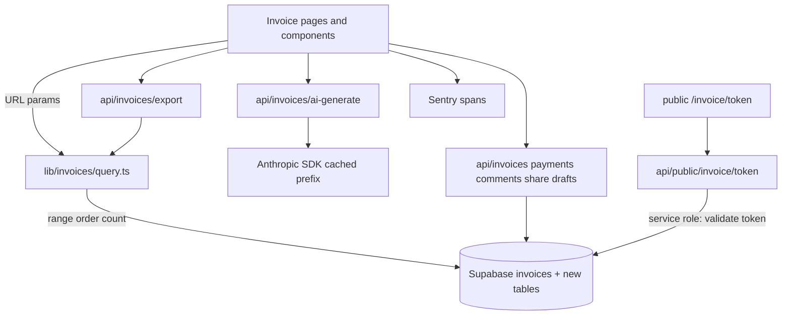

# Requirements

### Overview & Goals
Upgrade the existing SheetInvoicer invoicing module to an **enterprise-grade**, production-ready experience across the four invoice surfaces (list, detail, create/edit, generation) plus cross-cutting concerns (performance, i18n, accessibility, security, observability, deployment). The work builds **on top of the existing stack** — Next.js 16 App Router, Supabase + RLS, `next-intl` (8 locales with RTL `ar`), Stripe, Resend, Sentry, Anthropic SDK — and **reuses existing libraries** (`lib/accountingExport.ts`, `lib/currency.js`, `lib/audit/log.js`, `lib/invoiceTemplate.ts`, `lib/subscriptions/gate.js`) rather than introducing a new platform.

**Delivery shape (confirmed with user):** *depth-first vertical slices* — each surface is finished to production quality (logic + UI + i18n across all 8 locales + accessibility + tests + Sentry, behind a feature flag) before the next begins, in dependency order **List → Detail → Create/Edit → Generation**.

### Scope
**In Scope**
- **Invoice list** (`app/dashboard/invoices/page.tsx`): advanced filtering, multi-field sorting, bulk actions, real-time search, accessible server-side pagination + page-size selector, filtered CSV/PDF export.
- **Invoice detail** (`app/dashboard/invoices/[id]/page.tsx`): branded preview, status timeline, partial-payment tracking, auditable history log, threaded comments/notes, time-limited shareable public link with revocation + access analytics, print CSS.
- **Create/edit** (`new` + `[id]/edit`): smart template selection with live preview, server + local auto-save drafts with versioning, recurring schedules with exceptions/clone, multi-rate tax & discount management, multi-currency with rounding controls, client/project linking with validation.
- **Generation**: AI-assisted line-item/description generation, drag-and-drop template blocks, branding controls (logo/colors/typography/watermark), digital signature + tamper-evident seal.
- **Cross-cutting**: efficient large-list rendering via server-side pagination + indexed queries, caching, skeletons; full i18n coverage of new strings across all 8 locales incl. RTL; Sentry observability; Vercel deploy config, feature flags, rollback.

**Out of Scope**
- Replacing Supabase/Stripe/next-intl.
- New billing/subscription tiers (existing `lib/subscriptions` reused for gating).
- Native mobile apps.

### User Stories
- As a finance user, I want to filter, sort, search, and bulk-act on invoices so I can manage large volumes efficiently.
- As a user, I want to track partial payments and see an auditable history and status timeline per invoice.
- As a user, I want to share a time-limited public invoice link and see when it was viewed.
- As a user, I want branded, multi-template invoices with live preview and auto-saved drafts.
- As an international user, I want multi-currency, locale-aware formatting, and RTL support in my language.

### Functional Requirements
- Filtering by status, date range, client, project, amount range, tags, metadata; combinable; reflected in URL query params.
- Sorting by date, due date, amount, status, client, project, last updated.
- Bulk: mark paid, send, delete, export CSV/PDF, apply discount/tax.
- Search across invoice number, denormalized client/project, notes, and line-item text.
- Pagination: server-side, page-size selector, full ARIA + keyboard support.
- Export: deterministic, locale-aware numbers/dates, embedded export metadata.
- Status timeline with optional states (overdue/disputed/canceled); payment balance tracking.
- Public share link: expiry, revoke, view analytics.
- Drafts auto-save (local + server) with version history.
- Recurring schedules with exceptions and clone/copy.

### Non-Functional Requirements
- Large lists remain responsive via server-side pagination + indexed queries (optional row virtualization only if a single page still renders too many rows).
- WCAG 2.1 AA for all new interactive controls.
- All new UI strings localized in en, es, fr, de, it, pt, tr, ar (RTL-correct).
- Errors and key flows instrumented via Sentry; no secrets client-side.
- Zero-downtime Vercel deploys with feature-flag rollout and documented rollback.

# Technical Design

### Current Implementation
- **List** `app/dashboard/invoices/page.tsx` is a `'use client'` page that loads ALL invoices via Supabase browser client (`@/lib/supabase/client`), filters/sorts/paginates **in memory** (`pageSize = 9`), bulk-sends via `/api/send-invoice`, exports PDF client-side via `html2canvas` + `jspdf`.
- **Detail** `[id]/page.tsx` loads a single invoice + `time_entries`, applies template settings from `lib/invoiceTemplate.ts` (localStorage key `invoice_template_settings`), supports status updates and sending.
- **Create/Edit** `new/page.tsx` & `[id]/edit/page.tsx` use `useSmartDetection` hook + `SmartCurrencyTax`, `generateInvoiceNumber`, line items, manual totals.
- **Shared libs**: `lib/currency.js`, `lib/tax.js`, `lib/audit/log.js`, `lib/accountingExport.ts`, `lib/invoiceTemplate.ts`, `lib/subscriptions/gate.js`.
- **i18n**: `i18n/routing.ts` defines 8 locales, `localePrefix: 'never'`, `rtlLocales = {ar}`; messages in `messages/<locale>.json`.
- **DB**: migrations under `supabase/migrations/` (projects, audit_logs, recurring via `api/cron/generate-recurring`, indexes in `..._add_fk_and_list_sort_indexes.sql`).
- **API**: route handlers under `app/api/*` (e.g. `send-invoice`, `currency/rates`, `discount`, `accounting/export`).

> Per project guideline (`nextjs-agent-rules`): before writing code, consult the relevant guide in `node_modules/next/dist/docs/` since this Next.js 16 may differ from training data (RSC data fetching, route handlers, caching/revalidation, metadata).

### Key Decisions
The three core decisions below were **confirmed with the user**; the rest follow from the codebase investigation.
- **Server-side list pipeline + URL state (confirmed).** The list stops loading all rows; `lib/invoices/query.ts#buildInvoiceQuery` pushes filter/sort/pagination into Postgres via `.eq/.gte/.lte/.ilike/.contains/.order/.range` with `{ count: 'exact' }`. State lives in the URL via `useSearchParams` + `router.replace` (shareable, back-button-safe). The page stays a client component issuing range/count queries through the browser Supabase client (parity with the current dashboard pattern); `buildInvoiceQuery` is client/server-agnostic so the export route reuses it. (A full RSC conversion was considered and deferred to preserve the existing client-data architecture.)
- **Dedicated tables (confirmed).** New tables `invoice_payments`, `invoice_comments`, `invoice_share_links`, `invoice_drafts`, `invoice_history` — each with owner-scoped RLS (`auth.uid() = user_id`) and idempotent `do $$ … pg_policies … $$` policy creation mirroring `202606242036_add_audit_logs.sql`, plus `set_updated_at` triggers mirroring `202606210320_complete_missing_schema.sql`. Lightweight filter facets `tags text[]` and `metadata jsonb` are added as **columns** on `invoices` (GIN-indexed) because they are attributes of an already-RLS'd row, not relational entities.
- **History via a dedicated, owner-readable table — not `audit_logs` (confirmed).** `audit_logs` is service-role-write / admin-read-only (see its migration), so it cannot back an owner-visible change log. `invoice_history` is owner-readable; high-value actions are *additionally* mirrored to `audit_logs` through the existing `recordAuditLog` for the admin trail.
- **Public share link via a service-role API, not the anon client.** `/api/public/invoice/[token]` validates the token (unexpired, not revoked) using the service-role client (same pattern as `lib/audit/log.js` / `lib/ai/admin.ts`), returns a sanitized payload, and atomically bumps `view_count`/`last_viewed_at`. The public page calls this API only — it never queries Supabase with the anon key, avoiding the loose-RLS dependency the legacy `app/pay/[id]/page.tsx` relies on.
- **Export reuses the existing engine.** Extend `lib/accountingExport.ts` (`toCsv` + `buildInvoiceExportRows`) for locale-aware CSV and add `lib/invoices/pdf.tsx` using the already-installed `@react-pdf/renderer` for deterministic PDF. New `/api/invoices/export` accepts the **same** `InvoiceQueryParams` as the list so exports honor active filters, with embedded export metadata (generated-at, filter summary, locale).
- **New filters component.** `components/InvoiceFilters.tsx` is an untyped, hardcoded-English, light-theme orphan the list page does **not** use; build a new typed, themed, localized, URL-synced `components/invoices/InvoiceFilterBar.tsx` instead of extending it.
- **AI generation.** New `lib/ai/invoice.ts` reuses the cached-prefix pattern from `lib/ai/admin.ts` (frozen `system` with `cache_control: { type: 'ephemeral' }`, volatile data in the user turn) per the `claude-api` skill, exposed via `/api/invoices/ai-generate` and gated with `checkFeature(supabase, userId, 'ai')` from `lib/subscriptions/gate.js`.
- **Feature flags.** `lib/featureFlags.ts` reads `NEXT_PUBLIC_FF_*` env vars; every new surface ships behind a flag for safe Vercel rollout/rollback.
- **Denormalize client/project names.** PostgREST cannot `.order()` or OR-search across embedded relations, so `client_name`/`project_name` are stored on `invoices` (as `recurring_invoices` already does) to enable server-side sort and search by client/project.

### Proposed Changes
Work is organized as four depth-first slices; cross-cutting concerns are folded into each.
- **List slice** (`app/dashboard/invoices/page.tsx`): add `lib/invoices/query.ts` + `hooks/useInvoicesQuery.ts`; new `components/invoices/InvoiceFilterBar.tsx` (status, date range, client, project, amount range, tags, metadata), `SortControl` (created/due/amount/status/client/project/updated), accessible `InvoicePagination` + page-size selector, `BulkActionBar` (mark paid / send via `/api/send-invoice` / delete / apply discount+tax / export), debounced search across number + client/project + notes; filtered export via `/api/invoices/export`.
- **Detail slice** (`app/dashboard/invoices/[id]/page.tsx`): `StatusTimeline`, `PaymentTracker` (`/api/invoices/payments`), `InvoiceHistoryLog` (reads `invoice_history`), threaded `CommentThread` (`/api/invoices/comments`), `ShareLinkPanel` (`/api/invoices/share`) + public route `app/(public)/invoice/[token]` backed by `/api/public/invoice/[token]`; `@media print` stylesheet.
- **Create/Edit slice** (`new` + `[id]/edit`): `TemplateSelector` + `LivePreview` (extend `lib/invoiceTemplate.ts` registry with validation/fallbacks), `useAutoSaveDraft` (debounced localStorage + versioned `/api/invoices/drafts`), `RecurringScheduleEditor` (extends `recurring_invoices` + `api/cron/generate-recurring`), extended `SmartCurrencyTax` for multi-rate + inclusive/exclusive tax + fixed/percent discount + rounding (`lib/tax.js`, `lib/currency.js`), client/project auto-suggest + relationship validation.
- **Generation slice**: `AILineItemAssistant` (`/api/invoices/ai-generate` → `lib/ai/invoice.ts`), `TemplateBlockEditor` (existing `@dnd-kit`), `BrandingControls` + `SignatureSeal` (extend `InvoiceTemplateSettings`).
- **Folded into every slice**: new keys in all 8 `messages/*.json` (+ RTL classes for `ar`), WCAG 2.1 AA controls, Jest/Testing-Library tests, Sentry spans, and a `lib/featureFlags.ts` gate. Deploy/rollback notes added to `DEPLOYMENT.md`/`vercel.json`.

### Data Models / Contracts
```sql
-- Facet columns on the EXISTING invoices table (filterable, GIN-indexed)
alter table public.invoices
  add column if not exists tags text[] default '{}',
  add column if not exists metadata jsonb not null default '{}'::jsonb,
  add column if not exists updated_at timestamptz not null default now(),
  -- denormalized for server-side sort/search (PostgREST can't order/search embeds)
  add column if not exists client_name text,
  add column if not exists project_name text;
create index if not exists idx_invoices_tags on public.invoices using gin (tags);
create index if not exists idx_invoices_client_name on public.invoices (user_id, client_name);
create index if not exists idx_invoices_user_status_due_total
  on public.invoices (user_id, status, due_date, total, updated_at desc);

-- Dedicated tables (owner-scoped RLS: auth.uid() = user_id), one migration per slice
create table if not exists public.invoice_payments (
  id uuid primary key default gen_random_uuid(),
  invoice_id uuid not null references public.invoices(id) on delete cascade,
  user_id uuid not null references auth.users(id) on delete cascade,
  amount numeric(12,2) not null,
  currency text not null default 'USD',
  kind text not null default 'payment' check (kind in ('payment','credit','adjustment')),
  paid_at timestamptz not null default now(),
  note text,
  created_at timestamptz not null default now()
);
create table if not exists public.invoice_comments (
  id uuid primary key default gen_random_uuid(),
  invoice_id uuid not null references public.invoices(id) on delete cascade,
  user_id uuid not null references auth.users(id) on delete cascade,
  parent_id uuid references public.invoice_comments(id) on delete cascade,
  audience text not null default 'team' check (audience in ('team','client')),
  body text not null,
  created_at timestamptz not null default now()
);
create table if not exists public.invoice_share_links (
  id uuid primary key default gen_random_uuid(),
  invoice_id uuid not null references public.invoices(id) on delete cascade,
  user_id uuid not null references auth.users(id) on delete cascade,
  token text not null unique,
  expires_at timestamptz,
  revoked_at timestamptz,
  view_count integer not null default 0,
  last_viewed_at timestamptz,
  created_at timestamptz not null default now()
);
create table if not exists public.invoice_drafts (
  id uuid primary key default gen_random_uuid(),
  invoice_id uuid references public.invoices(id) on delete cascade,
  user_id uuid not null references auth.users(id) on delete cascade,
  version integer not null default 1,
  payload jsonb not null default '{}'::jsonb,
  created_at timestamptz not null default now()
);
create table if not exists public.invoice_history (
  id uuid primary key default gen_random_uuid(),
  invoice_id uuid not null references public.invoices(id) on delete cascade,
  user_id uuid not null references auth.users(id) on delete cascade,
  action text not null,
  before jsonb,
  after jsonb,
  created_at timestamptz not null default now()
);
-- recurring exception dates for the EXISTING recurring_invoices table
alter table public.recurring_invoices
  add column if not exists exceptions jsonb not null default '[]'::jsonb;
```
```ts
// lib/invoices/query.ts — single source of truth for list + export queries
export interface InvoiceQueryParams {
  status?: string[]; from?: string; to?: string;
  clientId?: string; projectId?: string;
  minAmount?: number; maxAmount?: number;
  tags?: string[]; search?: string;
  sort?: 'created'|'due'|'amount'|'status'|'client'|'project'|'updated';
  dir?: 'asc'|'desc'; page?: number; pageSize?: number;
}
// Accepts the browser OR server Supabase client; returns a range/ordered rows
// query plus a head:true count query for accessible pagination.
export function buildInvoiceQuery(
  supabase: SupabaseClient, userId: string, p: InvoiceQueryParams,
): { rows: PostgrestFilterBuilder; count: PostgrestFilterBuilder }
export function parseInvoiceParams(sp: URLSearchParams): InvoiceQueryParams
export function serializeInvoiceParams(p: InvoiceQueryParams): URLSearchParams
```

### Components
- New (under `components/invoices/`): `InvoiceFilterBar`, `SortControl`, `InvoicePagination`, `BulkActionBar`, `StatusTimeline`, `PaymentTracker`, `InvoiceHistoryLog`, `CommentThread`, `ShareLinkPanel`, `TemplateSelector`, `LivePreview`, `RecurringScheduleEditor`, `BrandingControls`, `AILineItemAssistant`, `TemplateBlockEditor`, `SignatureSeal`.
- Extended: `components/SmartCurrencyTax.tsx` (multi-rate / inclusive-exclusive / rounding), `lib/invoiceTemplate.ts` (template registry + branding + signature), `lib/accountingExport.ts` (locale-aware CSV rows).
- Superseded: legacy `components/InvoiceFilters.tsx` (orphaned, untyped) is replaced by `InvoiceFilterBar` and left untouched.

### File Structure
- `app/dashboard/invoices/**` — refactored `page.tsx` / `[id]/page.tsx` / `new/page.tsx` / `[id]/edit/page.tsx`.
- `components/invoices/*` — all new co-located components listed above.
- `app/(public)/invoice/[token]/page.tsx` — public share view (calls the API below).
- `app/api/invoices/{export,share,payments,comments,drafts,ai-generate}/route.ts` and `app/api/public/invoice/[token]/route.ts`.
- `lib/invoices/{query.ts,pdf.tsx}`, `lib/ai/invoice.ts`, `lib/featureFlags.ts`.
- `hooks/{useInvoicesQuery.ts,useAutoSaveDraft.ts}`.
- One migration per slice under `supabase/migrations/` (list facets/indexes; detail tables; drafts + recurring exceptions; template/branding columns).
- `messages/*.json` — new `invoices.*` keys for all 8 locales; `__tests__/invoices-i18n-parity.test.js`.

### Architecture Diagram


### Risks
- **Regression risk** moving the list from in-memory to DB-side filtering — mitigate with `buildInvoiceQuery` unit tests covering each param combo plus a URL parse/serialize round-trip test.
- **Data leakage** via new tables or the public share route — mitigate with explicit owner-scoped RLS, a service-role-only public route, token expiry/revocation, and negative-access (cross-user) tests.
- **Legacy `app/pay/[id]` anon read** is left untouched, but its loose pattern is deliberately **not** reused for sharing; flagged as a later follow-up.
- **Locale-aware export** across 8 locales — centralize number/date formatting in `lib/currency.js` + one export util; snapshot-test `de` and `ar`.
- **AI cost/latency** — gate via `checkFeature`, cap `max_tokens`, reuse the cached system prefix, and always fall back to manual entry.

# Testing

### Validation Approach
Validate each delivered slice with Jest + Testing Library (existing `jest.config.js`, `@testing-library/react`) for components/hooks and pure-logic unit tests for libs, plus `npm run lint` and `npm run build` to catch type/route regressions. Verify i18n by asserting all new keys exist in every `messages/*.json`.

### Key Scenarios
- `buildInvoiceQuery` produces correct Supabase filters/order/range for representative `InvoiceQueryParams` combinations.
- List page: applying filters/sort/search updates URL params and triggers a new server query; pagination + page-size controls work and are keyboard/ARIA accessible.
- Bulk actions: mark paid/send/delete/export/apply tax-discount update selected invoices and report per-item results.
- Detail: payment entries update balance; status timeline reflects state; history log records changes; comments thread renders parent/child.
- Share link: valid token within expiry renders invoice and increments view count; expired/revoked token is denied.
- Drafts: auto-save persists local + server versions and can restore a prior version.
- Export: CSV/PDF output is deterministic and locale-aware for a sample locale (e.g. `de`, `ar`).

### Edge Cases
- Empty filter results show accessible empty state.
- RTL (`ar`) layout for new components.
- Multi-rate inclusive/exclusive tax and rounding correctness.
- Recurring schedule with exception dates and clone.
- Unauthorized access to another user's invoice/share link is blocked by RLS.

### Test Changes
- Add unit tests under `__tests__/` for `lib/invoices/query.ts`, export builders, payment-balance math, and share-token validation, plus Testing-Library tests for `InvoiceFilterBar`, `BulkActionBar`, `PaymentTracker`, `CommentThread`, and `ShareLinkPanel`.
- Add `__tests__/invoices-i18n-parity.test.js` for the `invoices` namespace, mirroring `__tests__/subscription-i18n-parity.test.js` (key parity, no empty values, ICU placeholder consistency).

# Delivery Steps

### * Step 1: List page — server-side query, filters, sorting, search & pagination
The invoice list filters/sorts/paginates in Postgres with all state encoded in the URL, replacing in-memory loading.

- Before wiring data fetching, consult `node_modules/next/dist/docs/` for Next.js 16 conventions (per the `nextjs-agent-rules` guideline).
- Add `lib/invoices/query.ts` with `InvoiceQueryParams`, `buildInvoiceQuery` (Postgres `.eq/.gte/.lte/.ilike/.contains/.order/.range` + `{ count: 'exact' }`), and `parseInvoiceParams`/`serializeInvoiceParams`; unit-test every param combination and the URL round-trip.
- Add a migration: `tags text[]` + `metadata jsonb` + `updated_at` columns on `invoices`, denormalized `client_name`/`project_name` (kept in sync on write, for server-side sort/search), a GIN index on `tags`, and the composite `(user_id, status, due_date, total, updated_at)` index.
- Add `hooks/useInvoicesQuery.ts` and refactor `app/dashboard/invoices/page.tsx` to drive state from `useSearchParams`/`router.replace` and render server-paged results.
- Add `components/invoices/InvoiceFilterBar.tsx` (status, date range, client, project, amount range, tags, metadata), `SortControl`, debounced search (number + denormalized client/project + notes + line-item text), and accessible `InvoicePagination` + page-size selector (ARIA + keyboard).
- Add `lib/featureFlags.ts`, localize all new strings in the 8 `messages/*.json`, and add `__tests__/invoices-i18n-parity.test.js` mirroring `subscription-i18n-parity.test.js`.

###   Step 2: List page — bulk actions & filtered CSV/PDF export
Users can act on many invoices at once and export exactly what the active filters show.

- Add `components/invoices/BulkActionBar.tsx`: mark paid, send (existing `/api/send-invoice`), delete, and apply discount+tax, with per-item success/failure reporting and an accessible selection model.
- Extend `lib/accountingExport.ts` for locale-aware CSV rows and add `lib/invoices/pdf.tsx` using `@react-pdf/renderer` for deterministic PDF.
- Add `app/api/invoices/export/route.ts` (bearer-auth like `app/api/accounting/export/route.ts`) that reuses `buildInvoiceQuery` so exports honor active filters, embedding export metadata (generated-at, filter summary, locale).
- Wrap bulk + export flows in Sentry spans; add tests for export builders and the bulk reducer; localize new strings across all 8 locales.

###   Step 3: Detail page — status timeline, partial payments & history log
The detail page shows a full lifecycle timeline, partial-payment balance, and an owner-visible audit log.

- Add a migration creating `invoice_payments` and `invoice_history` with owner-scoped RLS and idempotent policies.
- Add `app/api/invoices/payments/route.ts` (record payment/credit/adjustment, recompute balance), writing `invoice_history` rows on every change and mirroring high-value actions to `audit_logs` via `recordAuditLog`.
- Add `components/invoices/StatusTimeline.tsx` (created→sent→viewed→paid + overdue/disputed/canceled) and `PaymentTracker.tsx` (partial payments, credits, running balance) into `app/dashboard/invoices/[id]/page.tsx`.
- Add `components/invoices/InvoiceHistoryLog.tsx`; make controls WCAG-AA, localize, and unit-test the balance math + history writes.

###   Step 4: Detail page — comments, public share link & print
Teams can discuss invoices and share a secure, time-limited public link; the invoice prints cleanly.

- Add a migration creating `invoice_comments` and `invoice_share_links` with owner-scoped RLS.
- Add `app/api/invoices/comments/route.ts` (threaded, team/client audience) and `app/api/invoices/share/route.ts` (create/revoke tokens).
- Add `app/api/public/invoice/[token]/route.ts` using the service-role client to validate token expiry/revocation, return a sanitized payload, and bump `view_count`/`last_viewed_at`; add `app/(public)/invoice/[token]/page.tsx` that calls only this API.
- Add `components/invoices/CommentThread.tsx` and `ShareLinkPanel.tsx`, a `@media print` stylesheet, negative-access tests (expired/revoked/cross-user), i18n, and Sentry spans.

###   Step 5: Create/Edit — templates, live preview, drafts, recurring, money & linking
Authoring supports branded templates, versioned auto-save, recurring schedules, and robust tax/currency math.

- Add a migration creating `invoice_drafts` and adding `exceptions jsonb` to `recurring_invoices`.
- Add `components/invoices/TemplateSelector.tsx` + `LivePreview.tsx` (extend `lib/invoiceTemplate.ts` registry with validation/fallbacks) into `new/page.tsx` and `[id]/edit/page.tsx`.
- Add `hooks/useAutoSaveDraft.ts` (debounced localStorage + versioned `app/api/invoices/drafts/route.ts`) with a restore UI.
- Add `RecurringScheduleEditor.tsx` (schedules, exception dates, clone/copy) integrating `app/api/cron/generate-recurring`.
- Extend `components/SmartCurrencyTax.tsx` for multi-rate, inclusive/exclusive tax, fixed/percent discount, and rounding (`lib/tax.js`, `lib/currency.js`); add client/project auto-suggest + relationship validation; localize and test.

###   Step 6: Generation — AI content, drag-drop blocks, branding & signatures
Generation gains gated AI assistance, customizable template blocks, branding, and a signature/seal.

- Add `lib/ai/invoice.ts` (cached system prefix per the `claude-api` skill) and `app/api/invoices/ai-generate/route.ts`, gated with `checkFeature(supabase, userId, 'ai')`; add `components/invoices/AILineItemAssistant.tsx` with a manual fallback.
- Add `components/invoices/TemplateBlockEditor.tsx` using the existing `@dnd-kit` for drag-and-drop blocks, placeholders, and reusable templates.
- Extend `InvoiceTemplateSettings` and add `components/invoices/BrandingControls.tsx` (logo, color palette, typography, watermark) + `SignatureSeal.tsx`.
- Localize new strings across 8 locales, add component/unit tests, Sentry spans, and a feature-flag gate; record zero-downtime deploy + rollback notes in `DEPLOYMENT.md`/`vercel.json`.