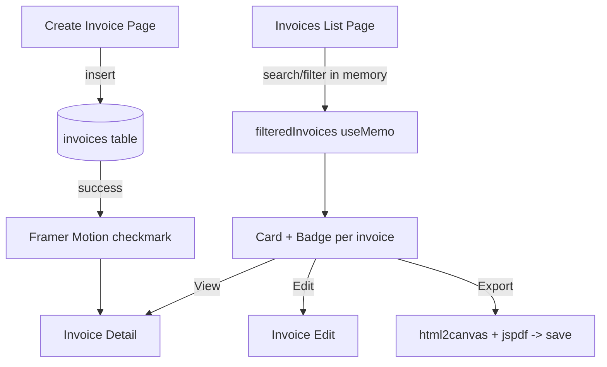

# Requirements

### Overview & Goals
Phase 4 of the dark design-system rollout. Redesign the **Invoice List** (`app/dashboard/invoices/page.tsx`) and **Invoice Creation** (`app/dashboard/invoices/new/page.tsx`) pages using the Phase 1 design system (`Card`, `Button`, `Badge`, tokens) and Phase 2/3 conventions. No other pages are touched and nothing is deployed — report and wait, consistent with prior phases.

### Scope
**In Scope**
- Invoice List: search bar with icon, All/Paid/Pending/Overdue filter buttons, redesigned card view, per-invoice info (client name, amount, date, status badge), hover actions (View, Edit, Export).
- Invoice Creation: clean grouped form sections with labels, always-visible live total panel, prominent action buttons at the bottom, Framer Motion success animation on save.
- New translation keys added to all 8 language files (en, ar, de, es, fr, it, pt, tr).

**Out of Scope**
- Detail page (`[id]/page.tsx`) and edit page (`[id]/edit/page.tsx`) redesign.
- Backend/schema changes; bulk-send logic stays functionally unchanged (only restyled).
- Deployment.

### User Stories
- As a user, I want to search and filter my invoices quickly so I can find a specific one.
- As a user, I want clear hover actions (View/Edit/Export) on each invoice card.
- As a user, I want to export an invoice to PDF directly from the list.
- As a user creating an invoice, I want a clean grouped form with a live total and a satisfying success animation on save.

### Functional Requirements
- **Search**: client-side instant filtering of loaded invoices by client name and invoice number.
- **Filters**: quick buttons All/Paid/Pending/Overdue (plus existing Draft/Sent retained in logic); active button uses accent styling.
- **Cards**: each shows invoice number, client name, amount+currency, due date, and a status `Badge` (Paid=success/green, Pending=accent/yellow, Overdue=red, Draft/Sent neutral).
- **Hover actions**: View (detail page), Edit (edit page), Export (client-side PDF via html2canvas+jspdf), revealed/emphasized on card hover.
- **Creation form**: grouped sections (Client & Project, Dates & Currency, Line Items, Tax & Notes), live total panel always visible, prominent bottom Create/Cancel buttons.
- **Success animation**: Framer Motion animated checkmark overlay on successful save before redirect.
- Existing functionality (bulk send, sort, pagination, CSV import, validation) preserved.

### Non-Functional Requirements
- Maintain RTL support (Arabic) and dark-theme consistency.
- No regressions to `tsc --noEmit` or `npm run build`.
- Respect existing `useTranslations('invoices')` namespace.

# Technical Design

### Current Implementation
- **List** `app/dashboard/invoices/page.tsx`: `'use client'`, loads invoices via `createClient()` Supabase query filtered by `user_id`, with `statusFilter` (`select`) + `sortBy` (`select`) re-querying on change. Renders a `framer-motion` grid of light/`dark:` Tailwind cards. Has bulk-send, page-selection, pagination, and a local `getStatusColor` helper.
- **Creation** `app/dashboard/invoices/new/page.tsx`: `'use client'`, loads clients/projects, line-item editor with `useMemo` `subtotal`/`taxAmount`/`total`, validation, inserts into `invoices`, then `router.push` to the new invoice. Uses light/`dark:` Tailwind styling and inline `<input>`/`<select>` with borders.
- **Design system**: `components/ui/Card.tsx` (glassmorphism + hover glow, accepts `onClick`, `hoverGlow`, `className`), `components/ui/Button.tsx` (`variant` primary/secondary, `size`, `loading`), `components/ui/Badge.tsx` (`variant` default/accent/secondary/success/outline). Tokens: `background`, `surface`, `card`, `border`, `accent`, `success`, `text-primary`, `text-secondary`, `rounded-card`, `rounded-button`, `shadow-glow*`, `duration-250`.
- **Deps available**: `framer-motion` (already imported in list), `html2canvas` + `jspdf` (installed in earlier phases, used in `dashboard/page.tsx` and `reports/page.tsx`), `lucide-react`, `react-hot-toast`.

### Key Decisions
- **Search/filter = client-side instant** (per user): filter the already-loaded `invoices` array in memory by client name / invoice number; keep status as quick-filter buttons. Existing server-side `statusFilter` query can remain for the initial status scope, but buttons drive an in-memory derived list for instant feedback.
- **Export = client-side PDF** (per user): reuse the proven dynamic-import `html2canvas` + `jspdf` pattern. Each card gets a hidden capture region (or capture the card node) → render to canvas → add to a jsPDF doc → save as `<invoice_number>.pdf`. Show success/error toasts via `react-hot-toast`.
- **Success animation = Framer Motion overlay** (per user): full-card/overlay animated checkmark using `framer-motion` (`AnimatePresence` + scale/opacity spring) shown on successful insert, then `router.push` to the new invoice after the animation completes.
- Reuse `Card`/`Button`/`Badge` everywhere rather than bespoke markup, matching Phase 3 dashboard.

### Proposed Changes
**Invoice List (`page.tsx`)**
- Add `searchQuery` state and a `filteredInvoices` `useMemo` deriving from `invoices` (search by `invoice_number` + `clients.name`, plus active status button).
- Replace the page header with the dark style (title + subtitle + primary `Button` 'New Invoice' with `Plus` icon).
- Add a search bar (`Search` lucide icon inside a `surface` rounded input) and a row of filter `Button`s (All/Paid/Pending/Overdue) with accent active state.
- Replace `getStatusColor` cards with `Card` components; status rendered via `Badge` (`statusBadgeVariant` helper). Each card shows client name, amount, due date.
- Add hover-revealed action row: View (`Link` to detail), Edit (`Link` to edit), Export (button → `exportInvoicePdf(invoice)` client-side PDF). Use `group`/`group-hover` Tailwind utilities.
- Restyle bulk-send controls, selection, progress, pagination, empty state, loading and error states to dark tokens (`Card`/`Button`/accent spinner) — keeping logic intact.

**Invoice Creation (`new/page.tsx`)**
- Wrap the form in `Card`-based grouped sections with section headings: Client & Project, Dates & Currency, Line Items, Tax & Notes.
- Restyle inputs/selects with dark tokens (border, `bg-surface`, focus ring accent); keep ids/names/validation.
- Keep the live `subtotal`/`tax`/`total` panel but make it an always-visible sticky/highlighted summary `Card`.
- Make bottom actions prominent: primary `Button` Create (with `loading`), secondary Cancel.
- Add `successOpen` state + Framer Motion `AnimatePresence` overlay with animated checkmark; on insert success set `successOpen=true`, then redirect on animation `onAnimationComplete`/timeout.

### Data Models / Contracts
```ts
// list helpers
function statusBadgeVariant(status?: string): 'success' | 'accent' | 'default'
const filteredInvoices = useMemo(() => invoices
  .filter(byStatusButton)
  .filter(i => matches(searchQuery, i.invoice_number, i.clients?.name)), [invoices, statusButton, searchQuery])
async function exportInvoicePdf(invoice: Invoice): Promise<void> // html2canvas + jspdf, toast on success/error
```
No API or DB contract changes.

### Components
- `Card`, `Button`, `Badge` (existing) — reused on both pages.
- New local helpers/sub-components within each page (e.g. success overlay, KPI-less filter bar); no new shared component files required (optional small `SuccessOverlay` inline).

### File Structure
- Modified: `app/dashboard/invoices/page.tsx`
- Modified: `app/dashboard/invoices/new/page.tsx`
- Modified: `messages/{en,ar,de,es,fr,it,pt,tr}.json` (new `invoices.search`, `invoices.filters.*`, `invoices.actions.{edit,export,exporting,exported,exportFailed}`, `invoices.new.successAnimation` keys).

### Architecture Diagram


### Risks
- **html2canvas capturing dark theme**: ensure background is set so PDF isn't transparent/black-on-black; mirror options used in dashboard/reports capture.
- **Status mapping**: existing data includes `draft`/`sent` beyond the four requested buttons — keep them filterable under 'All' and map badges so no status renders blank.
- **RTL**: hover action alignment and overlay must respect existing RTL handling.
- **Translation key collisions**: existing `invoices.status` / `invoices.actions` objects contain stray numeric-index keys — add new keys without disturbing existing ones.

# Testing

### Validation Approach
Static verification only (consistent with prior phases; no deploy). Confirm type-safety, build success, and JSON validity, then manually reason through the key flows.

### Key Scenarios
- List renders with `Card`/`Badge`; typing in search filters by client name and invoice number instantly.
- Clicking All/Paid/Pending/Overdue updates the visible set; active button shows accent state.
- Hover reveals View/Edit/Export; Export downloads a `<invoice_number>.pdf` and shows a success toast.
- Creation form shows grouped sections, live total updates as items/tax change, and a Framer Motion checkmark overlay appears on successful save before redirect.

### Edge Cases
- Empty invoice list → dark empty state with CTA.
- Search with no matches → 'no results' message.
- Export failure (canvas/jspdf error) → error toast, no crash.
- Invoices with `draft`/`sent` statuses still render a badge under 'All'.
- RTL (Arabic) layout for filter bar, hover actions, and overlay.

### Test Changes
- No new automated tests planned; run `npx tsc --noEmit` and `npm run build`, and validate all 8 `messages/*.json` parse and contain the new keys.

# Delivery Steps

### ✓ Step 1: Redesign Invoice List with search, filters, and dark cards
The invoices list page uses the Phase 1 design system with instant search, status filter buttons, and redesigned cards.

- Rewrite `app/dashboard/invoices/page.tsx` header to dark tokens with a primary `Button` 'New Invoice' (`Plus` icon).
- Add `searchQuery` state and a `filteredInvoices` `useMemo` filtering loaded invoices by `invoice_number` and `clients.name`.
- Add a search bar with a `Search` lucide icon and a row of All/Paid/Pending/Overdue filter `Button`s with accent active state.
- Replace bespoke cards with `Card` + `Badge` (via a `statusBadgeVariant` helper) showing client name, amount, currency, and due date.
- Restyle bulk-send controls, selection, progress bar, pagination, empty/loading/error states to dark tokens while preserving existing logic.

### ✓ Step 2: Add hover actions and client-side PDF export to list cards
Each invoice card reveals View/Edit/Export actions on hover, with Export generating a PDF client-side.

- Add a hover-revealed action row using `group`/`group-hover` utilities: View (`Link` to detail), Edit (`Link` to edit), Export (button).
- Implement `exportInvoicePdf(invoice)` using dynamically-imported `html2canvas` + `jspdf` (mirroring the dashboard/reports pattern), saving as `<invoice_number>.pdf`.
- Ensure the capture has a solid dark/light background so the PDF is not transparent.
- Show `react-hot-toast` success/error notifications for export.

### ✓ Step 3: Redesign Invoice Creation form with grouped sections and live total
The create-invoice page presents a clean grouped form with an always-visible live total and prominent actions.

- Restructure `app/dashboard/invoices/new/page.tsx` into `Card`-based grouped sections: Client & Project, Dates & Currency, Line Items, Tax & Notes.
- Restyle all inputs/selects/textarea with dark tokens (border, `bg-surface`, accent focus ring), keeping existing ids, names, and validation.
- Convert the subtotal/tax/total panel into an always-visible highlighted summary `Card`.
- Replace bottom buttons with a prominent primary `Button` Create (with `loading`) and a secondary Cancel.

### ✓ Step 4: Add Framer Motion success animation on save
Saving a new invoice shows an animated success checkmark before redirecting.

- Add a `successOpen` state and a Framer Motion `AnimatePresence` overlay with an animated (scale/opacity spring) checkmark.
- Trigger the overlay on successful Supabase insert, then `router.push` to the new invoice after the animation completes.
- Ensure the overlay respects RTL and dark theme.

### ✓ Step 5: Add translations to all language files and verify build
All new UI strings are translated across the 8 supported languages and the project type-checks and builds.

- Add new keys to `messages/{en,ar,de,es,fr,it,pt,tr}.json`: `invoices.search`, `invoices.filters.*` (all/paid/pending/overdue), `invoices.actions.{edit,export,exporting,exported,exportFailed}`, and a success-animation label under `invoices.new`.
- Avoid disturbing existing `invoices.status`/`invoices.actions` keys.
- Validate all 8 JSON files parse, then run `npx tsc --noEmit` and `npm run build` to confirm no regressions.
- Report changes and wait for instruction (do not deploy).