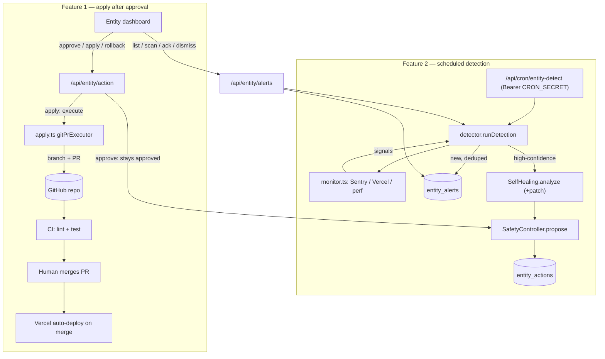

# Requirements

### Overview & Goals

Upgrade the existing **Entity** (`lib/entity/*`, `app/dashboard/entity`, `app/api/entity/*`) — a deliberately *human-in-the-loop* AI operations layer — with three capabilities, **without breaking its safety model**:

1. **Apply approved fixes** — a new **Apply** step that turns an already-approved code-fix proposal into a real change by opening a GitHub **Pull Request** (CI runs tests; a human merges; Vercel deploys on merge).
2. **Auto-detect issues** — a scheduled cron that polls Sentry, Vercel, and performance signals, raises **alerts**, and files AI **fix proposals** automatically.
3. **Database tables** — confirm/apply the existing `entity_*` migration and add a new `entity_alerts` table for detected issues.

These map to the user's confirmed decisions: **Apply only after approval**, **Git PR + CI deploy**, **scheduled cron poll**.

### Scope

**In Scope**
- New **Apply** action on `approved` code-fix proposals → opens a branch + PR via the Git host API (`lib/entity/apply.ts`).
- Deployment/CI **status reporting** (`lib/entity/deploy.ts`) + a GitHub Actions workflow that runs `lint` + `test` on PRs.
- Monitoring clients + detector + protected cron (`lib/entity/monitor.ts`, `lib/entity/detector.ts`, `app/api/cron/entity-detect/route.ts`).
- Alerts persistence + API (`entity_alerts` table, `app/api/entity/alerts/route.ts`) and dashboard **Alerts** section + **Apply** button (`app/dashboard/entity/page.tsx`).
- i18n keys for the new UI across all 8 locales; `vercel.json` cron registration; `DEPLOYMENT.md` env docs.

**Out of Scope**
- **Autonomous merge/deploy** — the Entity never force-merges or self-deploys (the user chose *Apply only after approval*; a human merges the PR). This preserves the documented design: *"Nothing in this system acts autonomously on production, customers, or money."*
- Editing the running serverless function's own repo at runtime (technically impossible on Vercel); all code change happens via PR.
- New billing, pricing, or marketing behavior; only the Entity ops layer changes.

### User Stories
- As an **admin**, I want an **Apply** button on an approved fix so the Entity opens a reviewed PR instead of me hand-applying the diff.
- As an **admin**, I want the Entity to **detect production errors on its own** (Sentry/Vercel/perf) and queue both an alert and a proposed fix, so I don't have to paste errors in manually.
- As an **admin**, I want every applied fix to land as a **PR with passing CI** that I merge, and to be able to **roll it back** (close PR/branch), so risk stays bounded and auditable.
- As an **operator**, I want detection to run on a **schedule** without an always-on server, reusing the project's existing cron pattern.

### Functional Requirements

**FR1 — Apply after approval**
- A fix proposal (`type: healing.fix`) carries a structured, machine-applicable **patch** in its payload.
- `approve` leaves a code-fix in `approved` (no auto-execute); a new **`apply`** decision runs the Git executor and transitions it to `executed`, storing the PR URL/branch in `result`.
- **Apply** is only available on an `approved` code-fix **with a valid patch**; otherwise the action is review-only.
- **Roll back** an executed fix closes the PR and deletes the branch.
- The emergency stop continues to block `apply` (it routes through `SafetyController.execute`).

**FR2 — Auto-detect issues**
- A protected cron (`Authorization: Bearer $CRON_SECRET`) polls Sentry issues, Vercel failed deployments/logs, and performance signals.
- New, de-duplicated issues create `entity_alerts` rows; high-confidence issues additionally file a `healing.fix` proposal (with patch) via the existing self-healing flow.
- The dashboard shows an **Alerts** section with a **Scan now** trigger and **acknowledge/dismiss** controls; new critical alerts may notify by email (Resend, already used).
- Missing provider credentials cause that source to be **skipped gracefully**, never a crash.

**FR3 — Database**
- The existing `202606260500_add_entity_system.sql` (creates `entity_commands`, `entity_actions`, `entity_settings`) is applied to Supabase.
- A new migration adds `entity_alerts` with the same admin-only RLS (`public.is_admin()`) and service-role write model used by `entity_actions`.

### Non-Functional Requirements
- **Safety:** human-in-the-loop preserved; no autonomous code-writing/deploy loop; approval + explicit Apply + PR + CI + human merge; full audit trail and rollback.
- **Security:** cron protected by `CRON_SECRET`; dashboard/API gated by `requireRole(ROLES.ADMIN)`; provider tokens are server-only; alert reads via RLS.
- **Testability:** all network clients (Git, monitoring) sit behind injectable interfaces — exactly like the existing `AICaller`/`EntityStore` — so logic is unit-tested with fakes and no network.
- **Compatibility:** Next.js 16 App Router route handlers and existing conventions (`runtime='nodejs'`, `dynamic='force-dynamic'`).
- **i18n:** new keys added to all 8 locale files to avoid missing-key errors.
- **Cost/caching:** new AI usage reuses the existing cached `createClaudeAICaller`; no new uncached SDK calls.

# Technical Design

### Current Implementation

The Entity is a clean, testable, **proposal-and-approval** system:

- **Types** (`lib/entity/types.ts`): `EntityAction` (`status`: pending→approved→executed/failed/rolled_back; `permission`: safe/medium/high; `payload`, `result`, `rollbackState`), `AICaller`, `EntityStore` contracts.
- **Safety** (`lib/entity/safety.ts`): `SafetyController.propose/approve/reject/execute/rollback`, all audited; `execute()` calls `assertRunnable()` (emergency stop) and only runs `approved` (or `safe` pending) actions. `classifyPermission('healing.fix') = 'high'`.
- **Self-healing** (`lib/entity/self-healing.ts`): `analyze(error)` calls the AI and files a `high` `healing.fix` **proposal** — today the payload only holds free-text `diagnosis`; it never edits code.
- **AI** (`lib/entity/ai.ts`): `createClaudeAICaller()` → Anthropic SDK, model `claude-opus-4-6`, **prompt caching** via `cache_control: ephemeral`, GPT-4o fallback.
- **Store** (`lib/entity/store.ts` + `supabase-store.ts`): `EntityStore` interface; in-memory (tests) + Supabase service-role (prod) implementations; audit via `lib/audit/log`.
- **Routes** (`app/api/entity/*`): admin-gated via `requireRole(ROLES.ADMIN)`; `action/route.ts` handles `approve|reject|rollback` (note: `approve` currently passes a no-op executor, so it jumps straight to `executed`).
- **Dashboard** (`app/dashboard/entity/page.tsx`): `ActionCard` renders Approve/Reject (pending) and Roll back (executed); status loaded from `/api/entity/status`.
- **Cron pattern** (`app/api/cron/send-reminders/route.tsx` + `vercel.json`): `GET` guarded by `Authorization: Bearer $CRON_SECRET`.
- **Migration** `supabase/migrations/202606260500_add_entity_system.sql`: already creates `entity_commands`, `entity_actions`, `entity_settings` (Feature 3's three tables) with `is_admin()` RLS.
- **Commander** (`lib/entity/commander.ts`): already parses **structured JSON from an AI reply** via `extractJson()` with graceful degradation — the pattern we reuse for the patch.

### Key Decisions

1. **Apply = open a PR, never self-deploy** *(user choice: Apply only after approval + Git PR + CI deploy).* `apply.ts` uses the **GitHub REST API via `fetch`** (no new dependency, provider-neutral) to create a branch, commit the patch files, and open a PR. CI runs tests on the PR; a **human merges**; Vercel deploys on merge. The Entity does **not** auto-merge — this is the faithful realization of "deploys if tests pass" within the human-in-the-loop design and Vercel's serverless constraints.
2. **Approve becomes approve-only for code fixes.** For `healing.fix`, `approve` no longer runs the no-op executor — it leaves the action `approved` so the **Apply** step exists. Other action types keep today's behavior. A new **`apply`** decision runs the real Git executor.
3. **Fix proposals carry a structured patch.** `SelfHealing.analyze()` is extended to also request and parse `payload.patch = { commitMessage, branchName?, files: [{ path, contents }] }` using the **same `extractJson` approach as `Commander`**. If no valid patch is parsed, the action stays **review-only** and Apply is disabled — a malformed/absent patch can never be applied.
4. **Detection is a scheduled cron** *(user choice).* `app/api/cron/entity-detect/route.ts` (Bearer `CRON_SECRET`) calls `detector.runDetection()`, mirroring `send-reminders`; registered in `vercel.json`.
5. **Network clients are injectable interfaces.** `GitClient` and `MonitorClient` mirror the existing `AICaller`/`EntityStore` seam, so `apply.ts`/`detector.ts` are unit-tested with fakes (no network) — consistent with `__tests__/entity/*`.
6. **Alerts reuse the Entity persistence + RLS pattern.** New `entity_alerts` table + `EntityStore` methods, admin-only reads via `is_admin()`, service-role writes — identical to `entity_actions`.
7. **Graceful degradation.** Missing `GITHUB_TOKEN`/`SENTRY_*`/`VERCEL_*` env vars skip that capability with a clear message instead of throwing (mirrors the `RESEND_API_KEY` guard in `send-reminders`).

### Proposed Changes

**Feature 1 — Apply (backend):**
- `lib/entity/self-healing.ts`: extend `analyze()` to produce `payload.patch` (parsed via an `extractJson`-style helper) alongside `diagnosis`.
- `lib/entity/apply.ts`: `GitClient` interface + `createGitHubClient()` (fetch → `api.github.com`: get base ref, create branch, put file contents, open/close PR, delete branch, read PR checks) + `createGitPrExecutor(git)` returning `{ result: { prUrl, prNumber, branch }, rollbackState: { prNumber, branch } }`.
- `lib/entity/deploy.ts`: `getDeploymentStatus(git, prNumber)` — reports CI check/test status and merge/deploy state; **no autonomous deploy**.
- `app/api/entity/action/route.ts`: add `apply` decision (`safety.execute(approvedFix, gitPrExecutor)`); make `approve` leave `healing.fix` in `approved`; extend `rollback` to close PR + delete branch for code fixes.
- `.github/workflows/entity-pr-checks.yml`: run `npm ci`, `npm run lint`, `npm test` on PRs (the CI gate).

**Feature 2 — Auto-detect (backend):**
- `lib/entity/monitor.ts`: `MonitorClient` interface + `createMonitorClient()` (Sentry issues, Vercel failed deployments, performance signals via `fetch`) → normalized `DetectedSignal[]`.
- `lib/entity/detector.ts`: `runDetection(entity, monitor)` — collect signals, **dedupe by fingerprint** vs open alerts, insert `entity_alerts`, and for high-confidence signals call `selfHealing.analyze()` to file a `healing.fix` proposal; returns a summary.
- `app/api/cron/entity-detect/route.ts`: protected `GET` → `runDetection`; add to `vercel.json` crons.
- `app/api/entity/alerts/route.ts`: admin `GET` (list) + `POST { op: 'scan'|'acknowledge'|'dismiss', alertId? }`; optional Resend notification for new critical alerts.

**Feature 3 — Database:**
- Apply existing `202606260500_add_entity_system.sql`.
- New `supabase/migrations/202606260600_add_entity_alerts.sql` (`entity_alerts` + RLS + indexes).
- Extend `EntityStore` (`store.ts`, in-memory, `supabase-store.ts`) with alert CRUD.

**Frontend (`app/dashboard/entity/page.tsx`) + i18n:**
- `ActionCard`: **Apply** button on `approved` code-fix with valid patch; show PR link in `result`.
- New **Alerts** section: `loadAlerts()`, `AlertCard`, **Scan now**, acknowledge/dismiss, severity styling.
- Add keys to all 8 `messages/*.json`.

### Data Models / Contracts

```ts
// types.ts (additions)
export type AlertSource = 'sentry' | 'vercel' | 'performance'
export type AlertStatus = 'open' | 'acknowledged' | 'resolved' | 'dismissed'
export interface EntityAlert {
  id: string
  source: AlertSource
  severity: 'low' | 'medium' | 'high' | 'critical'
  title: string
  fingerprint: string            // dedup key
  status: AlertStatus
  details: Record<string, unknown>
  linkedActionId: string | null  // the proposed fix
  createdAt: string
  updatedAt: string
}

// self-healing payload (additions)
interface FixPatch { commitMessage: string; branchName?: string; files: { path: string; contents: string }[] }

// apply.ts
export interface GitClient {
  getBaseRef(): Promise<{ branch: string; sha: string }>
  createBranch(name: string, fromSha: string): Promise<void>
  putFile(branch: string, path: string, contents: string, message: string): Promise<void>
  openPullRequest(branch: string, title: string, body: string): Promise<{ number: number; url: string }>
  closePullRequest(number: number): Promise<void>
  deleteBranch(name: string): Promise<void>
  getPrChecks(number: number): Promise<{ state: 'pending' | 'success' | 'failure' }>
}

// monitor.ts
export interface DetectedSignal { source: AlertSource; fingerprint: string; title: string; severity: EntityAlert['severity']; details: Record<string, unknown> }
export interface MonitorClient { collectSignals(): Promise<DetectedSignal[]> }
```

- Action API: `POST /api/entity/action { actionId, decision: 'approve'|'reject'|'rollback'|'apply' }`.
- Alerts API: `GET /api/entity/alerts → { alerts }`; `POST { op, alertId? }`.
- Env: `GITHUB_TOKEN`, `GITHUB_REPO` (owner/name), `GITHUB_BASE_BRANCH` (default `main`), `SENTRY_AUTH_TOKEN`/`SENTRY_ORG`/`SENTRY_PROJECT`, `VERCEL_API_TOKEN`/`VERCEL_PROJECT_ID`, reuse `CRON_SECRET`.

### Components
- **`ActionCard`** (modified): add `onApply` + `apply`/`applying` labels; render Apply on approved code-fix; link to PR.
- **`AlertCard`** (new, in the dashboard page): severity badge, source, acknowledge/dismiss.
- **`SafetyController`** (reused unchanged): `apply` flows through `execute()` → emergency-stop + audit honored.
- **`SelfHealing`** (modified): now emits a structured patch.

### File Structure
```
lib/entity/
  apply.ts        (new)  GitClient + createGitHubClient + createGitPrExecutor
  deploy.ts       (new)  CI/deploy status reporting (no auto-deploy)
  monitor.ts      (new)  MonitorClient (Sentry/Vercel/perf)
  detector.ts     (new)  runDetection: alerts + fix proposals
  self-healing.ts (mod)  emit payload.patch
  types.ts        (mod)  EntityAlert + patch types
  store.ts        (mod)  alert CRUD on EntityStore + in-memory impl
  supabase-store.ts (mod) alert CRUD (service role)
  index.ts        (mod)  wire/export new modules
app/api/entity/action/route.ts   (mod)  add 'apply'; approve-only fixes; PR-aware rollback
app/api/entity/alerts/route.ts   (new)  list / scan / acknowledge / dismiss
app/api/cron/entity-detect/route.ts (new) protected cron → runDetection
app/dashboard/entity/page.tsx    (mod)  Apply button + Alerts section
supabase/migrations/202606260600_add_entity_alerts.sql (new)
.github/workflows/entity-pr-checks.yml (new)
vercel.json (mod)  register entity-detect cron
messages/*.json (mod, 8 files)  apply + alerts keys
DEPLOYMENT.md (mod)  new env vars + cron docs
__tests__/entity/ apply.test.ts, detector.test.ts, alerts-store.test.ts (new)
```

### Architecture Diagram


### Risks
- **Serverless can't edit its own repo / redeploy itself** → mitigated by GitHub PR + Vercel-on-merge; the Entity never self-deploys.
- **AI patch could be wrong/destructive** → review-gated (approve), explicit Apply, lands as a PR (not prod), CI must pass, human merges; rollback closes PR/branch; missing/invalid patch disables Apply.
- **No existing CI** → add `.github/workflows/entity-pr-checks.yml` so tests actually gate the PR (assumes the repo is hosted on GitHub Actions; if not, document the equivalent check).
- **Provider creds/rate limits** → graceful skip + clear errors; cron protected by `CRON_SECRET`.
- **Alert noise/duplication** → fingerprint dedup vs open alerts.
- **Behavior change to `approve`** (code fixes no longer auto-execute) → scoped to `healing.fix`; covered by updated tests.
- **i18n drift across 8 locales** → add keys everywhere in the same change.

# Testing

### Validation Approach
Follow the existing `__tests__/entity/*` conventions: pure logic with **in-memory store** and **injected fakes** (`AICaller`, new `GitClient`, `MonitorClient`); assert on resulting action/alert state and the **audit trail**. Run `npm test`, `npm run lint`, and `npx tsc --noEmit` on changed files; confirm a clean Vercel build.

### Key Scenarios
- **Apply happy path:** an `approved` `healing.fix` with a valid patch → `apply` calls the fake `GitClient`, transitions to `executed`, and stores `result.prUrl`; audit shows `entity.action_executed`.
- **Approve-only:** approving a `healing.fix` leaves it `approved` (Apply available), while a non-fix action keeps prior behavior.
- **Detection → alert + proposal:** `runDetection` with a fake `MonitorClient` returning one Sentry signal creates exactly one `entity_alerts` row and one `pending` `healing.fix` proposal carrying a patch.
- **Cron auth:** `entity-detect` returns 401 without `Bearer $CRON_SECRET` and runs detection with it.
- **Alerts API:** `GET` lists alerts; `POST { op:'acknowledge'|'dismiss' }` updates status; `POST { op:'scan' }` triggers a detection run.
- **Dashboard:** Apply button shows only on `approved` code-fix with a patch; Alerts section renders, scans, acknowledges, and dismisses.

### Edge Cases
- **No/invalid patch:** `analyze()` returns no `payload.patch` → action stays review-only; Apply is disabled; `apply` on it is rejected with a 400.
- **Emergency stop engaged:** `apply` is blocked by `SafetyController.execute` (`EntityStoppedError` → 423).
- **Rollback of an applied fix:** closes the PR and deletes the branch via `GitClient`, then records `rolled_back`.
- **Missing provider env vars:** that source is skipped; detection still completes for the others; no crash.
- **Duplicate signal:** a repeated fingerprint does not create a second open alert or duplicate proposal.
- **Git API failure during apply:** `execute()` captures it → action `failed` with the error; no partial PR left dangling (branch cleanup attempted).

### Test Changes
- **New:** `__tests__/entity/apply.test.ts` (executor + rollback with fake `GitClient`), `__tests__/entity/detector.test.ts` (alerts + proposals + dedup with fake `MonitorClient`), `__tests__/entity/alerts-store.test.ts` (in-memory alert CRUD).
- **Update:** `__tests__/entity/safety.test.ts` / `modules.test.ts` for the new approve-only-for-fixes behavior and the `payload.patch` shape.
- **Note:** provider HTTP clients (`createGitHubClient`, `createMonitorClient`) are thin `fetch` wrappers exercised via their interfaces with fakes; live API calls are out of scope for unit tests.

# Delivery Steps

### ✓ Step 1: Data foundation: entity_alerts table, alert types, and store CRUD
The Entity can persist alerts, and all Entity tables exist in Supabase (Feature 3).

- Add `supabase/migrations/202606260600_add_entity_alerts.sql` creating `public.entity_alerts` (id, source, severity, title, fingerprint, status, details jsonb, linked_action_id, timestamps) with admin-only RLS via `public.is_admin()` and indexes on `status`, `fingerprint`, `created_at`, mirroring `entity_actions`.
- Document applying the pre-existing `202606260500_add_entity_system.sql` (creates `entity_commands`, `entity_actions`, `entity_settings`) to Supabase as part of deployment.
- Extend `lib/entity/types.ts` with `EntityAlert`, `AlertSource`, `AlertStatus`, and the `FixPatch` payload shape.
- Extend the `EntityStore` interface (`lib/entity/store.ts`) and both implementations (in-memory + `lib/entity/supabase-store.ts`) with `insertAlert`, `listAlerts`, `updateAlert`, and `findAlertByFingerprint` (service-role writes; snake_case mapping).
- Add `__tests__/entity/alerts-store.test.ts` covering in-memory alert CRUD and dedup lookup.

### ✓ Step 2: Auto-detection backend: monitoring clients, detector, cron, and alerts API (Feature 2)
A protected cron polls Sentry/Vercel/performance, raises deduped alerts, and files AI fix proposals.

- Add `lib/entity/monitor.ts`: a `MonitorClient` interface plus `createMonitorClient()` that fetches Sentry issues, Vercel failed deployments/logs, and performance signals, normalized into `DetectedSignal[]`; missing provider env vars skip that source gracefully.
- Add `lib/entity/detector.ts`: `runDetection(entity, monitor)` that collects signals, dedupes by `fingerprint` against open alerts, inserts new `entity_alerts`, and for high-confidence signals files a `healing.fix` proposal via `selfHealing.analyze()`; returns a summary.
- Add `app/api/cron/entity-detect/route.ts`: a `GET` handler guarded by `Authorization: Bearer $CRON_SECRET` (mirroring `send-reminders`) that calls `runDetection`; register it in `vercel.json` crons.
- Add `app/api/entity/alerts/route.ts`: admin-gated `GET` (list alerts) and `POST { op: 'scan'|'acknowledge'|'dismiss', alertId? }`, with an optional Resend email for new critical alerts.
- Wire new modules into `lib/entity/index.ts`; add `__tests__/entity/detector.test.ts` (alerts + proposals + dedup using a fake `MonitorClient`).

### ✓ Step 3: Apply-fix backend: structured patch, Git PR executor, deploy/CI status, and action route (Feature 1)
Approving then applying a code-fix opens a real GitHub PR; CI runs tests; rollback closes it.

- Extend `lib/entity/self-healing.ts` so `analyze()` also emits a structured `payload.patch` (`{ commitMessage, branchName?, files[] }`) parsed from the AI reply using an `extractJson`-style helper (mirroring `Commander`); absent/invalid patch leaves the action review-only.
- Add `lib/entity/apply.ts`: a `GitClient` interface, `createGitHubClient()` (fetch → `api.github.com`: base ref, create branch, put files, open/close PR, delete branch, read checks), and `createGitPrExecutor(git)` returning `result: { prUrl, prNumber, branch }` and matching `rollbackState`.
- Add `lib/entity/deploy.ts`: `getDeploymentStatus(git, prNumber)` reporting CI/test + merge/deploy status — explicitly no autonomous merge or deploy.
- Update `app/api/entity/action/route.ts`: add the `apply` decision (`safety.execute` of an approved `healing.fix` with the Git executor); make `approve` leave code fixes in `approved`; extend `rollback` to close the PR and delete the branch.
- Add `.github/workflows/entity-pr-checks.yml` running `npm ci`, `npm run lint`, `npm test` on PRs; add `__tests__/entity/apply.test.ts` (executor + rollback + emergency-stop + missing-patch) with a fake `GitClient`.

### ✓ Step 4: Dashboard: Apply button on approved fixes (Feature 1 UI)
Admins can apply an approved fix from the Entity dashboard and see the resulting PR.

- Update `ActionCard` in `app/dashboard/entity/page.tsx` to accept `onApply` and `apply`/`applying` labels, rendering an **Apply** button only when `action.status === 'approved'`, `action.type === 'healing.fix'`, and a valid `payload.patch` is present.
- Add an `apply` branch to the `decide` callback that posts `{ decision: 'apply' }` to `/api/entity/action`, shows a busy state, and refreshes status.
- Render the PR link from `action.result.prUrl` on executed fixes and keep Roll back wired to the PR-aware rollback.
- Add i18n keys (`entity.approvals.apply`, `entity.approvals.applying`, `entity.toasts.apply`) to all 8 `messages/*.json` files.

### ✓ Step 5: Dashboard: Alerts section with scan/acknowledge/dismiss (Feature 2 UI)
The Entity dashboard surfaces auto-detected alerts with manual controls.

- Add an **Alerts** section and an `AlertCard` to `app/dashboard/entity/page.tsx`, with a `loadAlerts()` reader hitting `GET /api/entity/alerts`, severity/source badges, and empty/loading states.
- Add a **Scan now** button that posts `{ op: 'scan' }` and refreshes both alerts and status, plus per-alert **Acknowledge**/**Dismiss** actions posting `{ op, alertId }`.
- Show the linked fix proposal (when present) so the admin can jump to approving/applying it.
- Add i18n keys (`entity.alerts.*`: title, none, scan, scanning, acknowledge, dismiss, severity.*, source.*, status.*) to all 8 `messages/*.json` files; update `DEPLOYMENT.md` with the new env vars (`GITHUB_*`, `SENTRY_*`, `VERCEL_*`) and the `entity-detect` cron.